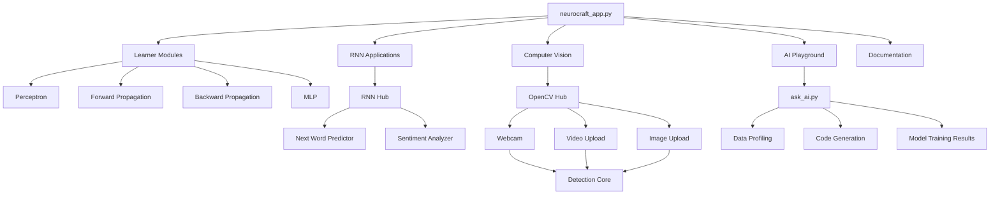
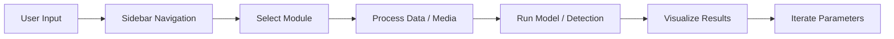

# NeuroCraft Lab

<div align="center">


[](https://neurocraft-ddlrjzcbnw9zdgam94j84q.streamlit.app/)

**An interactive neural network learning and experimentation toolbox built with Streamlit.**

</div>

---

## Live Demo

- **App URL:** https://neurocraft-ddlrjzcbnw9zdgam94j84q.streamlit.app/
- **Repo:** https://github.com/akshat24code/neurocraft

---

## Why NeuroCraft Lab?

NeuroCraft Lab combines concept learning + practical AI use-cases in one unified interface:

- Learn NN fundamentals step-by-step.
- Run RNN and Computer Vision mini-applications.
- Auto-profile datasets and generate training pipelines with AI assistance.
- Use built-in IRIS data or your own CSV files.

---

## Feature Highlights

### Interactive Learning Modules
- Perceptron (logic gates + custom CSV)
- Forward Propagation walkthrough
- Backward Propagation walkthrough
- Multi-Layer Perceptron (binary + multiclass)

### RNN Applications
- Next Word Predictor (WikiText-2 trained)
- Sentiment Analyzer (IMDB trained)

### Computer Vision Lab (OpenCV)
- Face Detection
- Eye + Smile Detection
- Stop Sign Detection
- Real-Time Face Count
- Input modes: Webcam, Video Upload, Image Upload
- Environment-aware behavior: local `cv2` vs cloud WebRTC

### AI Playground
- CSV auto-profiling and EDA
- Problem type suggestion
- AI-generated training code
- In-app execution with metrics and feature importance

### UX and Platform
- Sidebar-first grouped navigation
- Command-center style quick launches
- System Health dashboard
- Streamlit Cloud deployment ready

---

## Product Architecture



---

## Application Flow



---

## Repository Structure

```text
.
├── neurocraft_app.py
├── requirements.txt
├── packages.txt
├── DEPLOY_STREAMLIT.md
├── data/
│   └── IRIS.csv
└── src/
    ├── ai_playground_pages/
    │   └── ask_ai.py
    ├── application_pages/
    │   ├── open_cv/
    │   │   ├── open_cv_landing.py
    │   │   ├── open_cv_shared.py
    │   │   ├── open_cv_core.py
    │   │   ├── open_cv_webcam.py
    │   │   ├── open_cv_video.py
    │   │   ├── open_cv_image.py
    │   │   └── open_cv_detection.py
    │   └── rnn/
    │       ├── rnn_landing.py
    │       ├── next_word.py
    │       └── rnn_sentiment.py
    ├── learner_pages/
    │   ├── perceptron_ui.py
    │   ├── forward_propagation.py
    │   ├── backward_propagation.py
    │   └── mlp.py
    └── assets/
        ├── documents/
        ├── image/
        ├── open_cv/
        └── rnn/
```

---

## Getting Started (Local)

### 1) Clone

```bash
git clone https://github.com/akshat24code/neurocraft.git
cd neurocraft
```

### 2) Create Virtual Environment

```powershell
python -m venv .venv
.venv\Scripts\activate
```

### 3) Install Dependencies

```bash
pip install -r requirements.txt
```

### 4) Configure Environment Variables

Create `.env` in project root:

```env
NVIDIA_API_KEY=your_real_nvidia_key
```

### 5) Run Application

```bash
streamlit run neurocraft_app.py
```

---

## Streamlit Cloud Deployment

1. Push latest code to `main` branch.
2. In Streamlit Cloud, create app from this repo.
3. Set **Main file path** to `neurocraft_app.py`.
4. Add secret:

```toml
NVIDIA_API_KEY = "your_real_nvidia_key"
```

5. Save and reboot app.

Detailed guide: see `DEPLOY_STREAMLIT.md`.

---

## Configuration & Health

- Use **System Health** page to validate:
  - API key availability
  - IRIS dataset presence
  - Core asset availability
- For cloud usage, prefer Streamlit Secrets over `.env`.

---

## Tech Stack

- **Frontend/UI:** Streamlit
- **Data:** pandas, numpy
- **ML:** scikit-learn, xgboost
- **RNN:** PyTorch
- **Computer Vision:** OpenCV, streamlit-webrtc, av
- **Utilities:** python-dotenv, matplotlib, plotly

---

## Roadmap

- Add CNN learner module
- Add LSTM explainer mode
- Add richer training diagnostics (ROC, confusion matrix)
- Add model export/import workflows
- Add multilingual UX hints

---

## License

MIT License

---

## Maintainer

Maintained by **Akshat / NeuroCraft Project**.
