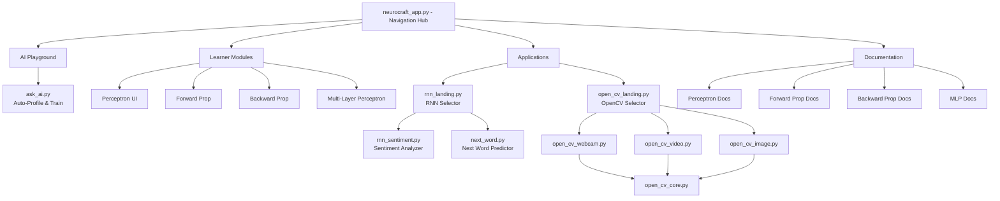
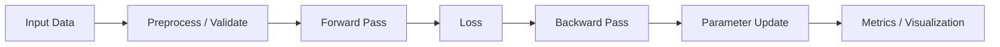

# NeuroCraft Lab


[](https://neurocraft-ddlrjzcbnw9zdgam94j84q.streamlit.app/)

An interactive **Streamlit-based learning toolbox** for understanding core **Neural Network concepts** and **Computer Vision techniques** through hands-on experimentation and visualizations.

**Live App**: https://neurocraft-ddlrjzcbnw9zdgam94j84q.streamlit.app/
> Since it's freely deployed, the app may need a few seconds to wake up.

---

## Highlights

- **Interactive learning UI** built with Streamlit
- **Learner Modules**: Step through neural network concepts
  - Perceptron (logic gates or custom CSV)
  - Forward & Backward Propagation walkthroughs
  - Multi-Layer Perceptron (MLP) — binary & multiclass
- **RNN Applications** with intuitive landing page
  - Next Word Predictor (WikiText-2 trained)
  - Sentiment Analyzer (IMDB trained)
- **Computer Vision** with modularized OpenCV detection
  - Face, Eye + Smile, Stop Sign, Face Count detection
  - Webcam (live), video upload, or image upload modes
  - Environment-aware (local cv2 vs. cloud WebRTC)
- **AI Playground**: Auto-profile datasets, generate & execute training scripts
- Built-in sample dataset (IRIS)

---

## New UI Preview

The app now includes a **sidebar-first navigation UI** for quick access to modules, similar to an LMS-style toolbox layout.

### Sidebar Sections
- Learner Modules
- RNN Applications
- Computer Vision
- AI Playground
- Documentation

### What's New in the UI
- One-click, grouped navigation from the left sidebar
- Active route highlighting for better orientation
- Home dashboard with guided/builder/explorer modes
- Command Center for direct module launching
- System Health panel to validate API key and core assets

---

## Getting Started

### 1️⃣ Clone the repository

```bash
git clone https://github.com/akshat24code/neurocraft.git
cd neurocraft
```

### 2️⃣ Create & activate a virtual environment

```powershell
python -m venv .venv
```
```powershell
.venv\Scripts\activate
```

### 3️⃣ Install dependencies

```bash
pip install -r requirements.txt
```

### 4️⃣ Run the app

```bash
streamlit run neurocraft_app.py
```

The app will open automatically at `http://localhost:8501`.

---

## Project Structure

```
.
├── neurocraft_app.py              # Main Streamlit entry point
├── requirements.txt
│
├── data/
│   └── IRIS.csv                   # Sample dataset for learner modules
│
└── src/
    ├── __init__.py
    │
    ├── ai_playground_pages/
    │   └── ask_ai.py              # Auto-profile datasets & generate training scripts
    │
    ├── application_pages/
    │   ├── open_cv/               # Modularized OpenCV detection
    │   │   ├── open_cv_landing.py         # Main entry point with radio selector
    │   │   ├── open_cv_shared.py          # Shared helpers & cascade loading
    │   │   ├── open_cv_core.py            # Pure detection logic (no Streamlit)
    │   │   ├── open_cv_webcam.py          # Webcam use case (local & WebRTC)
    │   │   ├── open_cv_video.py           # Video upload & processing
    │   │   ├── open_cv_image.py           # Image upload & sample images
    │   │   ├── open_cv_detection.py       # Backward compatibility wrapper
    │   │   ├── cascades/                  # Haar cascade XML files
    │   │   │   ├── haarcascade_*.xml
    │   │   └── sample/                    # Sample images for demo
    │   │
    │   └── rnn/                   # RNN applications with landing page
    │       ├── rnn_landing.py             # Central RNN selector (radio buttons)
    │       ├── next_word.py               # Next word predictor (WikiText-2)
    │       └── rnn_sentiment.py           # Sentiment analyzer (IMDB)
    │
    ├── learner_pages/             # Step-by-step learning modules
    │   ├── perceptron_ui.py
    │   ├── forward_propagation.py
    │   ├── backward_propagation.py
    │   └── mlp.py
    │
    └── assets/                    # Models, vocabularies, and documentation
        ├── image/
        │   └── nn_image.jpg       # Home page banner
        ├── documents/             # In-app documentation pages
        │   ├── perceptron.py
        │   ├── forward_propagation.py
        │   ├── back_propagation.py
        │   └── mnp.py
        ├── rnn/                   # RNN model assets
        │   ├── next_word/
        │   │   ├── vocab.pkl      # Vocabulary mapping
        │   │   └── rnn_wikitext2.pth  # Trained model weights
        │   └── (rnn_model.pth, word2idx.pkl for sentiment)
        ├── open_cv/               # OpenCV assets (cascades, samples)
        └── (config.pkl for sentiment model configuration)
```

---

## Architecture Overview



---

## Module Flow



---

## Usage Guide

### Navigation
Use the **sidebar** to access grouped sections:
- **Learner Modules** — Step-by-step neural network concept walkthroughs
- **RNN Applications** — Hub plus task shortcuts
- **Computer Vision** — OpenCV hub and mode shortcuts
- **AI Playground** — Auto-analyze datasets and auto-generate training scripts
- **Documentation** — Reference guides

### AI Playground
1. Upload a CSV file (max 50 MB)
2. App auto-profiles the dataset and suggests problem type
3. Choose a model and target column
4. LLM generates custom training script
5. View metrics and feature importances

### Learner Modules
- **Perceptron**: Logic gates or custom data, tune learning rate & iterations
- **Forward/Backward Propagation**: Step-by-step walkthroughs with visuals
- **MLP**: Binary & multiclass classification with custom CSV or IRIS

### RNN Applications (via central landing page)
1. Click **Application → RNN** in sidebar
2. Choose from radio buttons:
   - **Sentiment Analyzer** — Type a review, get sentiment + word-level breakdown
   - **Next Word Predictor** — Enter text, get top-3 next word predictions with scores

### OpenCV Detection (via central landing page)
1. Click **Application → OpenCV** in sidebar
2. Select detection type (Face, Eye+Smile, Stop Sign, Face Count)
3. Choose input mode:
   - **Webcam** — Real-time detection (uses cv2.VideoCapture locally or WebRTC on cloud)
   - **Upload Video** — Process frame-by-frame with optional download
   - **Image** — Upload or load sample image

---

## Data Input Rules

| Module | Input Format | Constraints |
|--------|--------------|-------------|
| **Perceptron** | CSV with 2 features + target | Binary features & target |
| **MLP** | CSV or IRIS | Numeric & categorical allowed; binary/multiclass target |
| **OpenCV** | Webcam, JPG/PNG/MP4/AVI/MOV | Max file size enforced |
| **RNN (Sentiment)** | Free text (English) | Review-style text recommended |
| **RNN (Next Word)** | Free text (English) | Trained on WikiText-2; 5-word context |
| **AI Playground** | CSV | Max 50 MB per file |

- Large datasets are restricted to maintain UI performance

---

## Dependencies

| Package | Version | Purpose |
|---------|---------|---------|
| `streamlit` | 1.x+ | Web UI framework |
| `numpy` | — | Numerical computation |
| `pandas` | — | Data handling & CSV parsing |
| `plotly` | — | Interactive visualizations |
| `opencv-python` | — | Computer vision & detection |
| `streamlit-webrtc` | — | Real-time video on Streamlit Cloud |
| `av` | — | Video format handling |
| `torch` & `torchvision` | — | RNN sentiment & next-word models |
| `scikit-learn` | — | ML models & preprocessing (AI Playground) |
| `requests` | — | NVIDIA LLM API calls |
| `python-dotenv` | — | Environment variable management |
| `speech-recognition` | — | Audio input (RNN Sentiment) |

---

## Architecture Decisions

### Modularization
- **OpenCV**: Separated into landing page + use-case modules (webcam, video, image) for code clarity
- **RNN**: Central landing page with radio selector bridges multiple RNN applications
- **Shared utilities**: `open_cv_shared.py` & `open_cv_core.py` separate UI logic from pure detection

### Environment Detection
- OpenCV webcam automatically detects local vs. Streamlit Cloud environment
- Local: Uses high-performance `cv2.VideoCapture` with no lag
- Cloud: Falls back to WebRTC for remote access

### Path Resolution
- All file paths use `Path(__file__).resolve()` for robustness across execution contexts
- Works reliably whether run as standalone or within Streamlit module routing

## Notes

- This project prioritizes **learning & explainability** over raw performance
- MLP includes standardization and one-hot encoding
- OpenCV cascades provide CPU-friendly detection without deep learning overhead
- AI Playground uses NVIDIA LLM API for dataset analysis and code generation
- Designed for **students, educators, and concept demonstrations**

---

## Contributing

Contributions are welcome! Areas for expansion:
- Additional neural network architectures (CNN, LSTM, Transformer)
- More computer vision detectors (hands, pose, objects)
- Extended RNN use cases (machine translation, text generation)
- Performance optimizations for large datasets

---

## License

MIT License — free to use, modify, and share for learning and beyond.

---

**Last Updated**: March 2026  
**Maintainer**: Dean's Project Team
